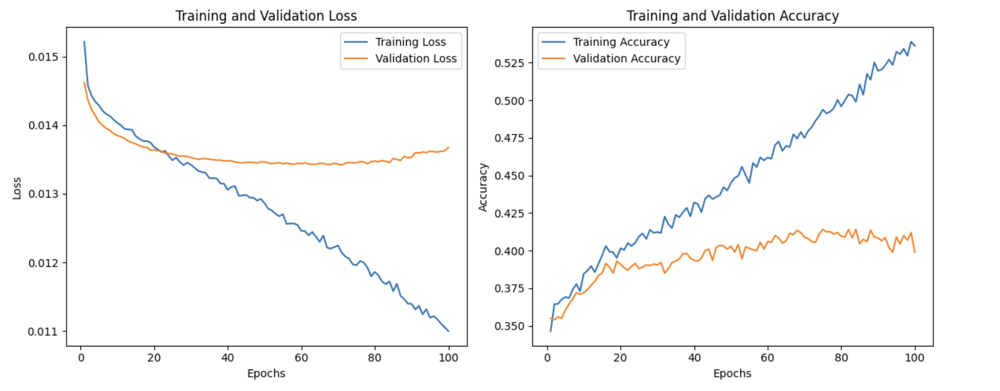
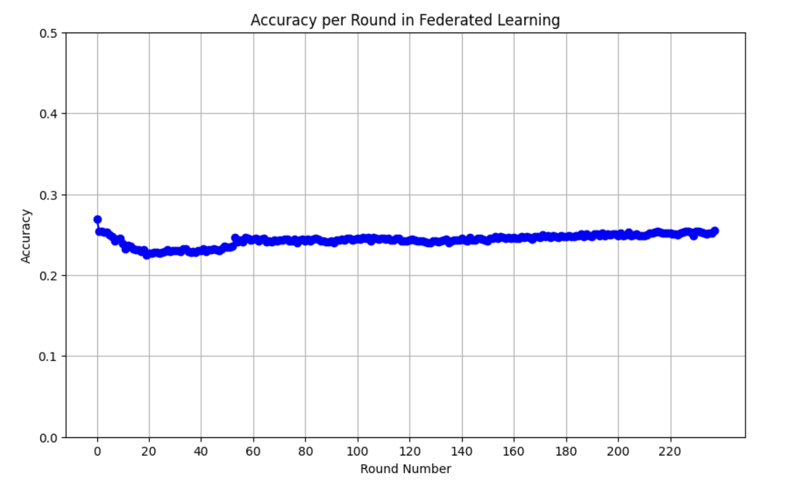

# Literature Review

An Analysis of the paper that first introduced federated learning in 2016, _Communication-Efficient Learning of Deep Networks from Decentralized Data_

[Visit the blog website for a more comprehensive analysis](https://expo.baulab.info/2023-Fall/babelpainterwell/)

Federated learning has gained widespread use in healthcare sectors where data sharing is often challenging due to concerns over user privacy and data ownership. Without adequate techniques to utilize these "isolated" data, we typically encounter data silos. Hospitals are eager to leverage their data but lack the knowledge to do so effectively. Introduced by Google in 2016, **federated learning was designed to tackle this issue by adhering to the core principle that only model gradients or weights, not raw data, are exchanged among servers.**

Yet, in recent years, we have not seen this technology adopted on a large scale, despite increasing societal concern for data privacy from both regulatory agencies and the public. One possible reason is that tech companies may lack the incentive to allow users to keep their data on local devices, as this data is a lucrative resource for them. **However, I am interested in investigating, from a technical standpoint, what factors are impeding the broader adoption of this technology.**

# Federated Averaging Code Implementation

[Visit the Colab notebook](https://colab.research.google.com/drive/1LIyYtxJQ5UTt9A95EvAfDNyz_blUF9X5)

## Objective

The primary objective of this code implementation is to demonstrate the efficacy of the **FedAvg algorithm** in reducing communication costs within a federated learning framework. This process comprises three key components:

- **Training a Sentiment Analysis Model**: Using vanilla stochastic gradient descent (SGD) optimization, applied outside a federated learning context. The purpose of this step is to establish a baseline model performance for subsequent experiments in FL settings.
- **Training with FedSGD Algorithm**: Utilizing the FedSGD algorithm (setting E = 1, B = size of local data), which involves performing a single batch gradient calculation per communication round. In this case, as the minibatch size matches the local dataset size, one batch is equivalent to one epoch in the FedSGD framework.
- **Training with FedAvg Algorithm**: Implementing the FedAvg algorithm (with E=5 and B=50), where more computation is executed locally. This represents a significant advancement of the algorithm, especially in addressing the high communication requirements typical of algorithms like FedSGD.

> **Note**: Due to resource constraints, only the vanilla SGD and FedAvg algorithm experiment has been completed, which required hours of training. As the FedSGD algorithm is expected to take significantly more time due to its high communication costs in the federated learning setting—possibly more than an order of magnitude compared to FedAvg—its experiment has been delayed.

## Dataset Preparation

This study utilizes the _YelpReview Sentiment Analysis dataset_, containing 10,000 Yelp reviews, each with review content and rating stars. The primary task is to predict the rating stars (ranging from 1 to 5) based on the review content.

### Dataset Preparation Steps

The datasets for the three models mentioned are prepared as follows, with each dataset first undergoing tokenization and padding before splitting:

- **Vanilla SGD**: The entire dataset is divided into 80% for training and 20% for testing with minibatch size of 100.
- **FedSGD**: The dataset is split into 10 shards, converted into 10 dataloaders with a batch size equal to the number of data points per shard, resulting in one batch per dataloader.
- **FedAvg**: Similar to FedSGD, the dataset is divided into 10 shards, but with a minibatch size of 50.

For both FedSGD and FedAvg models, to emulate non-IID and unbalanced data conditions, the raw dataset is sorted into classes before being divided into shards, with each shard containing varying numbers of data examples.

## Results

### Vanilla SGD Model

The Vanilla SGD model aims to establish a baseline performance for this sentiment analysis task, as the three models share a same network architecture. After training for 100 epochs, we clearly observe overfitting, and the val accuracy of around 40% is not considered good. However, this will serve as the benchmark for the FedAvg and FedSGD experiments. Specifically, we will examine how many communication rounds it takes for both FedAvg and FedSGD to reach this threshold.

### FedAvg Experiment Results

The experimental results presented in the paper were not successfully replicated in our code implementation, primarily due to time and computational constraints. The FedAvg algorithm ran for 4 hours over 238 rounds for each of the 10 clients and achieved an accuracy of 25.458%. The training was intentionally interrupted due to computational limits. We are eager to continue this experiment in the future. Despite these challenges, the notebook still merits examination. Any feedback is welcomed!

> **Please Explore our Federated Averaging Experiment Colab Notebook**
