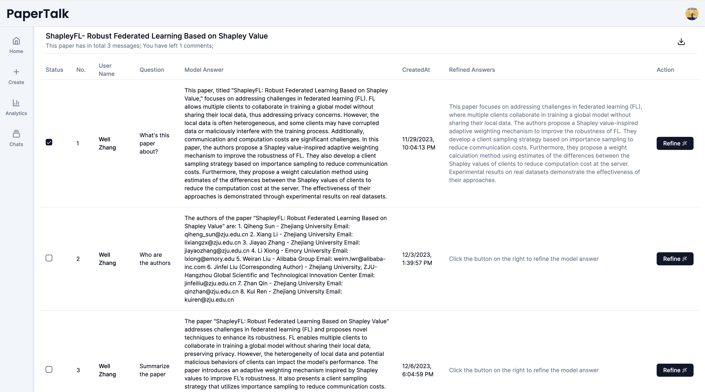

## TRY MY PRODUCT!

https://papertalk-well.vercel.app/

**You can check the Preview below under Motivation section**

## Introduction

PaperTalk is a tool created to demystify the complex terminology and concepts found in academic papers based on my personal needs while reading academic papers in the deep learning field. It combines LLM-supported explanations with feedbacks of human instructors, ensuring both immediate understanding and accurate, in-depth learning. I believe this product has strong extensibility, and its characteristic of fostering complementary interactions between AI and humans for asynchronous knowledge transfer can be applied to other fields without much burden.

## Updates

- To optimize the **fine-tuning** process for large language models, I have introduced a feature that allows each paper agent provider to refine answers. On the Analytics page, users can now download data that has been meticulously preprocessed. This dataset includes examples and target pairs, which are primed for direct use in the fine-tuning of Large Language Models (LLMs).

- I have implemented a Retrieval-Augmented Generation (RAG) feature, enabling each paper agent to access and review past chat histories between themselves and other users. **It's important to note that this functionality does not breach our commitment to keeping data localized on each end device.** Human paper provider or knowledge contributor retains ownership of all communications involving their paper agent.

## Motivation

PaperTalk was created to solve a personal challenge I encountered as a self-taught beginner in deep learning. While reading seminal papers in the field, I often found it difficult to fully comprehend all the terminology and expressions used. This limited understanding prevented me from diggingg deeper into sub-fields and addressing the puzzles I encountered within these papers. To resolve this, I tended to Google specific questions, like 'What is an attention head in the Transformer paper?' or asked ChatGPT, 'Are you familiar with the paper "Attention is All You Need"? Explain the attention head concept to me.' However, this approach made reading and comprehending papers time-consuming, and I often retained little information over time without accumulating answers to my confusions.

To address this issue, I had this idea of creating PaperTalk a product that would streamline the process of resolving these puzzles. This tool would not only answer questions but also keep a record of the inquiries made about a specific paper. However, a significant drawback of large language models like GPT-4 and GPT-3.5 is their propensity for hallucination. Relying solely on such models to solve academic puzzles seemed inadequate. During development, I incorporated human instruction, allowing a human instructor to provide feedback on the model's outputs.

Why would a human instructor volunteer for this? To provide some context, the task of reading seminal deep learning papers is part of a deep learning course I am taking this fall semester. An incentive for the instructor to use this product is that it offers a way to provide asynchronous feedback to students' questions. Even if questions can't be answered immediately, the instructor can provide improved or corrected answers later. This dual approach of AI and human input is the foundation of PaperTalk's design and functionality.

## Preview

- **Home Page:** Discover a wide range of academic papers in the public square that may pique your interest or address your queries


- **Chatting Page:** Engage with the AI to delve into the complexities of any paper and access comprehensive answers provided by expert contributors


- **Analytics Page:** Explore the array of questions posed about your uploaded papers and gain insights into the topics of interest



- **Refine Answer Page;** Utilize AI assistance to craft detailed and precise responses to the questions asked about your papers


- **Chats Page:** Browse through your interactions and revisit conversations with various paper agents

Chats Page


- **Upload Page;** Contribute to the community by uploading your papers, assisting others who seek answers or insights related to your work


## Future Works

Having seen the potential for individuals to accumulate knowledge by providing feedback to AI models, I look forward to finding ways to incentivize continuous human intelligence contributions, which could become a shortage especially as LLMs become more prevalent. To this end, I plan to use a distributed learning technique known as Federated Learning to explore its potential in achieving these goals. Updates will be added to my repository once completed.

**[Updates in the Federated Learning Directory]**

## Getting Started

First, run the development server:

```bash
npm run dev
```

Open [http://localhost:3000](http://localhost:3000) with your browser to see the result.

## More Build Details

- Yes, this product is another GPT-4 "wrapper," whose intelligence relies solely on the OpenAI API.
- Due to the context length limit of the model used (GPT-4), once a user's accumulated interaction with a paper exceeds 3072 tokens (by estimation), it's set to retain only the memory of the 5 most recent messages.
- There is a button on the Analytics page that allows for the downloading of all interactions (messages, model feedback, human comments), serving as a great resource for future model fine-tuning.
  ...

## Acknowledgments

[next13-ai-companion] by Antonio Erdeljac: My project utilized the partial UI structure shared by Antonio, including the sidebar and the navbar. The code can be found [here](https://github.com/AntonioErdeljac/next13-ai-companion).

[chatpdf-yt]: Special thanks to Elliott Chong, whose project [chatpdf-yt] provided significant inspiration for structuring my own work. Additionally, some code snippets, including AWS S3 functionality and parsing for Pinecone functionality, were greatly influenced by his codes. More details can be found [here](https://github.com/elliott-chong/chatpdf-yt).

## A Few More Words

This project is designed as a MVP to test my idea, and as such, factors like latency and database optimization were not primary considerations during its development. If you see any areas for improvement that could enhance the user experience, please feel free to submit a pull request and share your contribution.

# papertalk-well
